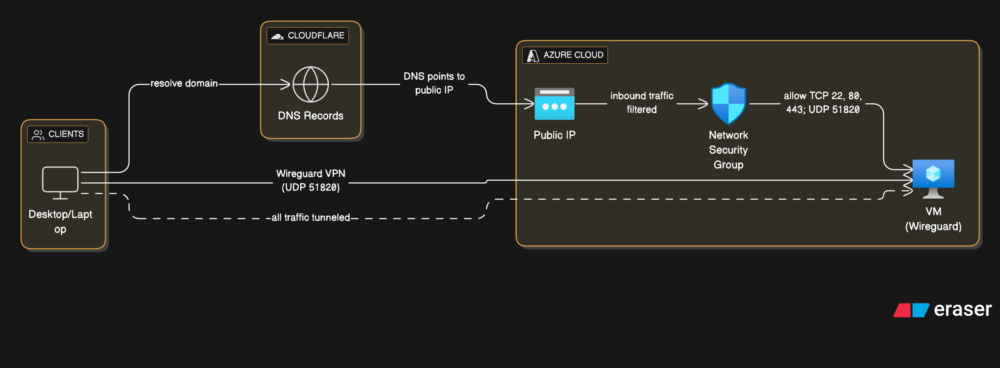
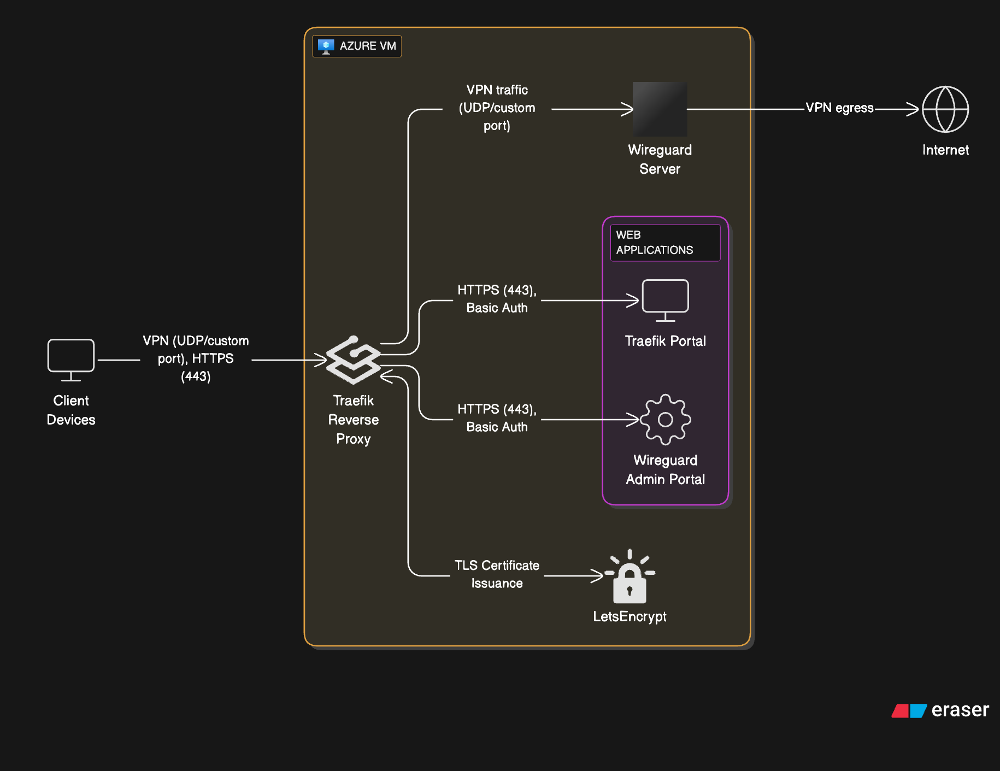

# Project: Personal VPN

## Overview
Before this project, I have no knowledge about VPN: how it works and how it is set up.

This small project is about me learning and having hands-on experience about VPN implementation with Wireguard and common computer networking knowledge.

## Architecture and Network Flow
For architecture, I used Terraform to provision a private network on Azure along with a VM secured by Network Security Group to only allow traffic from specific ports. The VM has a public IP attached to it and Cloudflare is manually configured to manage DNS records. The following applications are installed on the VM:
- Docker and Docker Compose: This is required by wg-easy
- wg-easy: An open-source solution to easily install Wireguard and manage it with an intuitive admin UI. IMHO, Wireguard official documentation is more suitable for advanced users, not beginner-friendly, especially when you are not having a good understanding of computer networking concepts before (like me). After a few attempts to read, I now have a grasp of understanding. I still find Wireguard difficult to set up in both server side and client side (because there are lots of commands to bring up and take down network interfaces). Then I found wg-easy, which provides a very nice admin UI and leverage Docker Compose to easily set up Wireguard as an VPN Gateway.
- Traefik: A reverse proxy in front of Wireguard Admin portal and Traefik portal. This is necessary to secure the wg-easy web UI by adding TLS layer as well as provide an unified place to control and round traffic to multiple services behind later. 

Architecture diagram:

For network traffic flow, by setting 2 DNS records type A on Cloudflare, we can access Traefik portal and wg-easy web UI publicly (which I think we should only allow VPN traffic instead). For VPN users, after importing client config generated by wg-easy web UI and enabling VPN connection, all the traffic is now encrypted, goes through the Traefik reverse proxy to our Wireguard VPN Gateway before going to the internet.

Network flow:

## High-level Implementation Steps
- Provision infrastructure (manually or automation with Terraform). Note that on Azure I need to enable IP forwarding feature on the network interface associated with the VM. Might need to do similar on other cloud providers.
- Add 2 DNS records type A on Cloudflare pointing to the provisioned VM: One for Traefik portal and one for wg-easy web UI. Make sure you already bought a domain name before :)
- Follow wg-easy instructions to set up Wireguard stack on the provisioned VM: https://wg-easy.github.io/wg-easy/latest/examples/tutorials/basic-installation/. In the Traefik installation steps, updates some essential values such as hostname, username and password, etc.

After finishing all steps above, I can log in to the wg-easy web UI, create a VPN client, download and send the client configuration to my client device. 

## Cost Analysis
Here are components can cost you and me money:
- Static public IP: $3.65/month
- Managed disk storage: $1.6/month 
- Domain name: $1-10/year
- Ingress/Egress network: Up to our usage

Other components are free within Azure free tier usage quota, same as Cloudflare.

## Enhancement Opportunities
- Security enhancement: We should only allow VPN traffic to access Traefik and wg-easy web UI
- Monitoring enhancement: Monitor compute usage and application status
- TLS certificate rotation

## Gained Knowledge
- VPN concepts
- Wireguard: How it works and how to get it up and running
- Traefik: Simple concepts and configurations
- eraser.io: To create diagrams with AI prompts 
- Azure cost optimization

## References
- https://ubuntu.com/server/docs/introduction-to-wireguard-vpn
- https://documentation.ubuntu.com/server/how-to/wireguard-vpn/vpn-as-the-default-gateway/#using-the-vpn-as-the-default-gateway
- https://www.wireguard.com/
- https://wg-easy.github.io/wg-easy/latest/
- https://doc.traefik.io/traefik/